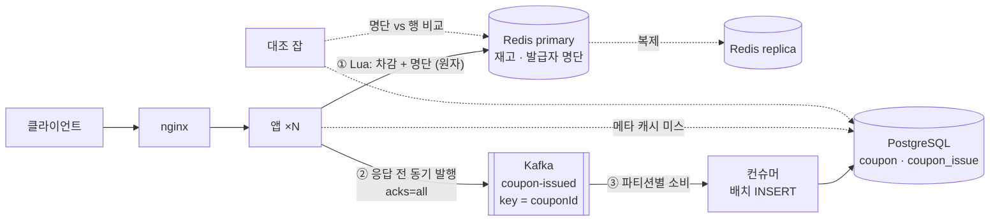
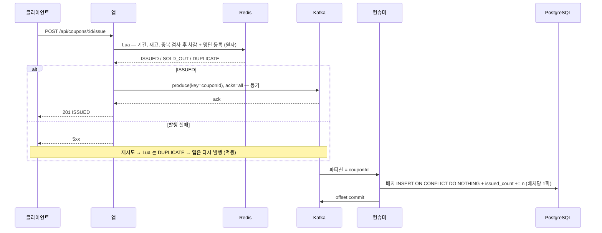
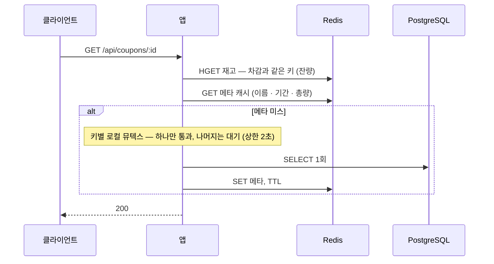

# 선착순 발급 시스템 — 설계

> 3주의 측정이 정한 것 위에, 측정이 답하지 않는 것은 내가 정했다. **측정 결과는 여기서 반복하지 않는다** — [README 4장](README.md#4-결과)과 `results/` 로 링크한다.
> **실험과 설계는 목적이 다르다.** 실험은 비교군 사이의 차이를 하나(동시성 제어 방식)로 유지하려고 구성을 최소로 잡았다 — Redis 큐와 앱 내 워커 한 대, 브로커 없음 (D-06). 설계는 실제 운영 형태로 가져가므로 **실험에 없던 요소가 들어온다** — 외부 브로커(Kafka), Redis replica, 대조 잡. 그것들은 측정하지 않았고 5장에 따로 모았다.
> **측정값:** 이 저장소의 숫자 · **문서 근거:** 측정하지 않았고 문서로 아는 것 · **결정:** 내가 고른 것과 버린 이유
>
> 기준 규모는 실험 조건 그대로다 — 쿠폰 1종 재고 100,000 · 순간 1,000 ~ 2,000 동시 · 앱 3대 · DB 커넥션 30. 브리프 3.2 의 제외 기능(사용 · 취소 · 알림 · 인증)은 설계하지 않는다.

---

## 1. 전체 구조

| 구성 요소 | 역할 | 진실의 소재 |
|---|---|---|
| **Redis** | 재고 차감 · 발급자 명단 · 잔량. **발급 판정이 일어나는 유일한 장소** | 발급 사실의 **원본** |
| **Kafka** | 발급 사실의 내구 기록. **앱이 응답 전에 직접 발행**한다 | 원본의 사본 — Redis 가 통째로 사라져도 남는다 |
| **컨슈머** | Kafka 를 읽어 DB 에 배치로 쓰는 워커. 실험의 `W4DbSyncWorker` 가 있던 자리 | — |
| **PostgreSQL** | `coupon_issue` 행 · `issued_count`. 조회 · 정산 · 감사의 기준이며 **발급 판정에는 관여하지 않는다** | 시스템 오브 레코드 |
| **대조 잡** | Redis 발급자 명단(SET)과 DB `coupon_issue` 행을 주기적으로 비교해 어긋난 쪽을 메운다 | — |

실험의 W4 는 Lua 가 Redis 큐에 `rpush` 하고 워커 한 대가 DB 로 옮겼다. **설계는 큐를 Redis 밖으로 뺀다.** 왜인지가 2장이다.

---

## 2. 발급 — 왜 이렇게 만드는가

### 왜 Redis 원자 차감인가

**측정값:** NFR-03 · 06 · 07 을 모두 통과한 유일한 전략이고, 3대에서도 100,000 정확히 · 5xx 0 — [README 5장](README.md#5-nfr-충족-매트릭스와-트레이드오프). 요청 경로에 DB 가 없으므로 커넥션 풀과 커밋 천장을 지나지 않고, **앱을 늘려도 DB 예산을 쪼갤 필요가 없다** — 3대에서 W1 · W3 를 무너뜨린 것이 예산 분할이었다.

### 결정 A — 응답은 Kafka 에 동기 발행한 뒤 준다

| 선택지 | 버린 이유 |
|---|---|
| Redis 차감 후 **즉시** 응답 (실험의 W4) | 사실이 메모리에만 있는 구간 — **측정값:** Redis 가 죽자 45,868건이 사라졌다 |
| DB 반영 후 응답 | 요청 경로에 DB 커밋이 돌아온다. W4 의 이점이 사라진다 |
| "접수" 응답 후 나중에 확정 | 두 단계 UX. 쿠폰은 결제가 아니라 그럴 이유가 없다 |
| **Redis 차감 → Kafka 동기 발행 → 응답** ✔ | "발급 = 확정" 의 단순한 의미를 유지하면서, 응답 전에 사실이 Redis 밖에 있다 |

**왜 Redis → Kafka 릴레이가 아니라 앱 → Kafka 직접인가.** Lua 가 Redis 스트림에 쓰고 릴레이가 Kafka 로 옮기면 차감과 기록은 원자적이지만, 릴레이가 옮기기 전까지 사실은 여전히 Redis 에만 있다 — chaos 가 잰 바로 그 창이다. 응답을 주기 **전에** Redis 밖에 있어야 하므로 앱이 직접 발행한다. **문서 근거:** 발행 왕복은 락 경합이 없는 append 라 수 ms 다. 측정하지 않았다 (5장).

### 이중 쓰기 — 차감과 발행은 원자적이지 않다

실험의 Lua 는 큐 적재까지 한 스크립트였다. 설계는 이 원자성을 포기하고 세 겹으로 갚는다.

| 겹 | 처리 | 남는 것 |
|---|---|---|
| 1 | 발행 실패 → 5xx. 재시도에서 Lua 가 DUPLICATE 를 돌려주면 **다시 발행**한다. 발행은 `couponId:userId` 키로 멱등, DB 는 `ON CONFLICT` 로 흡수 | 재시도하지 않는 클라이언트 |
| 2 | **대조 잡** — 명단에 있는데 행이 없으면 발행한다 | 대조 주기만큼의 지연 |
| 3 | 차감 직후 · 발행 전에 앱이 죽는 창 | 2 가 잡는다 |

DUPLICATE 경로에서도 발행하므로 정상적인 중복 요청(두 번 누름)도 이벤트를 하나 더 만든다. **결정:** 재시도와 정상 중복을 구분하지 않는다. 구분하려면 Lua 에 "발행됨" 상태가 필요하고 그것이 다시 이중 쓰기다.

### 결정 B — 왜 Redis Streams 가 아니라 Kafka 인가

**같은 원리다.** 둘 다 추가 전용 로그에 컨슈머 그룹과 ack 가 있다. 차이는 기능이 아니라 **어디에 있느냐**다.

| | Redis Streams | **Kafka** |
|---|---|---|
| 있는 곳 | 차감과 **같은 Redis** | **다른 시스템** |
| 차감과 기록의 원자성 | **있다** — `XADD` 를 Lua 에 넣으면 이중 쓰기가 없다 | 없다 → 위의 세 겹 |
| 장애 도메인 | 차감과 **같이 죽는다.** **측정값:** chaos 에서 Redis 가 비워지자 큐도 함께 사라졌다 | 분리. Redis 가 통째로 사라져도 발급 사실이 남는다 |
| 내구성의 기본값 | 메모리. 영속화(AOF)는 옵션이고 `everysec` 면 ≤ 1초 유실 | 디스크 + 복제(`acks=all`)가 기본 |
| 대가 | 없음 | 이중 쓰기 처리 · 컴포넌트 하나 |

**결정:** 발급 사실을 **차감과 다른 장애 도메인**에 둔다. 규모(10만) 때문이 아니다 — 규모만 보면 Streams 가 맞고, 원자성까지 공짜로 얻는다. Kafka 를 고른 것은 "Redis 가 사라지면 발급 사실도 사라진다" 는 실험의 실패 모드를 구조로 없애기 위해서이고, 그 값이 이중 쓰기 세 겹이다.

### 컨슈머 규칙

| 규칙 | 이유 |
|---|---|
| **파티션 키 = `couponId`** | 쿠폰 하나는 컨슈머 하나가 맡는다 → `issued_count` 갱신이 컨슈머 사이에서 경합하지 않는다 |
| **배치 INSERT + 배치당 카운터 1회** | 행마다 카운터를 올리면 실험 A 의 **뜨거운 행 경합**이 컨슈머 안에서 재현된다. **측정값:** 발급당 커밋 1회인 전략은 30분에 −15 ~ 28%, 0.002회인 W4 는 −2.7% — [`soak-followup` 3장](results/week3-soak-followup/summary.md) |
| **at-least-once + `ON CONFLICT DO NOTHING`** | offset 커밋 전에 죽으면 같은 배치를 다시 쓴다. 실험의 워커와 같은 규칙 |

쿠폰이 1종이면 파티션도 1개라 **컨슈머를 늘려도 그 쿠폰의 반영은 빨라지지 않는다** — 손잡이는 배치 크기다. **측정값:** 워커 1대 · 배치 500 이 초당 3,850건 — [`week2` 6장](results/week2-experiment-a/summary.md). 반영 지연은 이제 "잃는 크기" 가 아니라 "DB 조회가 얼마나 낡았는가" 다. 사실은 이미 Kafka 에 있다.

### 왜 W1 · W3 가 아닌가

3대에서 W1 은 커넥션을 쥔 채 락을 기다려 5xx 28,592, W3 는 락 타임아웃 503 이 62,768 — [README 4-2](README.md#4-2-3대에서-무엇이-깨지는가--1대-vs-3대). W1 이 답이 되는 경우는 "응답 = DB 커밋" 이 요구사항인 도메인(정산과 발급이 한 트랜잭션)뿐이고, 그때는 커넥션 예산을 인스턴스 수 × 스레드에 맞춰 다시 잡아야 한다. 쿠폰은 그 요구가 없다.

---

## 3. 조회 — 왜 이렇게 만드는가

### 결정 D — 잔량은 캐시가 아니라 Redis 카운터에서 읽는다

쓰기가 Redis 원자 차감이면 **잔량의 진실값은 이미 Redis 에 있다.** 그것을 캐시에 넣고 TTL 로 낡히는 것은 진실을 옆에 두고 사본을 읽는 일이다. 실험 B 는 스탬피드를 재현하려고 `remaining` 까지 캐시했고, 설계는 쓰기 경로와 합쳐 그 필요를 없앤다 — **실험 A 와 B 를 따로 보면 나오지 않는 결론이다.** 캐시에는 바뀌지 않는 메타만 남고, TTL 안의 stale 은 결함이 아니다.

### 메타 캐시 — 뮤텍스, 키가 많으면 지터를 함께

| 규칙 | 근거 |
|---|---|
| 미스 시 키별 뮤텍스 (C3) | **측정값:** 파동당 DB 조회 **20 ± 0**, 대기 734건 · 60ms 는 P99 에 안 보인다 — [README 4-4](README.md#4-4-ttl-만료-순간--stampede-20키--200-vu--5분) |
| 키가 수백 개면 TTL 지터를 **함께** | **측정값:** 지터 단독은 편차 ±26, 최악을 보장하지 않는다. 뮤텍스가 키당 1 을, 지터가 키들의 동시 만료를 맡는다 |
| XFetch(C4)는 기본값으로 쓰지 않는다 | **측정값:** β = 1 은 여유 0 의 설정 — 첫 만료를 못 막았다 |
| 뮤텍스는 로컬로 둔다 | 앱 N 대면 만료 순간 DB 조회는 키당 N — 3대 · 20키면 60. **문서 근거:** 산술이며 재지 않았다. 60 은 캐시 없는 9,515 옆에서 0 에 가깝고, 분산 락은 미스마다 Redis 왕복을 더한다 |

---

## 4. 장애 시 — 결정 C: Redis 가 죽으면 발급을 멈춘다

| 장애 | 동작 | 왜 |
|---|---|---|
| **Redis primary 다운** | **발급 중단 (503).** replica 승격 뒤 재개. 잔량 조회는 DB `issued_count` 로 폴백하고 "집계 중" 표시 | **측정값:** 45,868 유실은 "명단 없이 재시작해 계속 발급" 이 만들었다. 명단 없이 재개하지 않는다. **문서 근거:** 복제가 비동기라 승격 시 마지막 수 ms 의 차감이 빠질 수 있다 — 대조 잡의 **역방향**(행은 있는데 명단에 없음)이 명단을 채운다 |
| W1 폴백 (버림) | — | **결정:** Redis 의 재고 · 명단을 DB 와 재동기화하는 절차가 장애 중에 돌아야 한다. 복잡도가 이득을 넘는다. 10초 정전을 10초 발급 중단으로 받는다 — **측정값:** W3 가 chaos 에서 한 일이 정확히 이것이다 |
| **Kafka 발행 실패 · 다운** | 5xx. Redis 는 차감됐고 재시도는 DUPLICATE 경로로 재발행. 장기 다운이면 발급 중단 — 명단이 있으니 재고는 정확하다 | 2장 이중 쓰기 |
| **컨슈머 다운** | 발급 영향 없음. 반영 지연만 는다 | **측정값:** 워커 없이 30분 부하면 DB 가 39분 낡는다 |
| **DB 느려짐 · 다운** | 발급 영향 없음. 메타 캐시가 TTL 안이면 조회도 영향 없음 | **측정값:** soak 에서 요청 경로에 DB 가 없는 W4 만 −2.7% |
| **앱 인스턴스 다운** | 차감 후 · 발행 전 창의 요청은 5xx 또는 타임아웃 → 재시도 또는 대조 잡 | 2장 이중 쓰기 |

---

## 5. 측정하지 않은 것

| 항목 | 이 문서의 근거 |
|---|---|
| Kafka 동기 발행이 NFR-03 의 492ms 에 얹는 지연 | 문서 근거 — 수 ms |
| Redis AOF · replica 승격 시 유실 창 | 문서 근거 — 실험은 영속화 없이 쟀다 |
| 다중 인스턴스에서 뮤텍스 피크 = N × 키 | 산술 |
| 컨슈머 다중화의 반영 처리량 | 측정은 워커 1대뿐 |
| 대조 잡의 비용과 주기, DUPLICATE 재발행의 이벤트 양 | 추정 |

실험 환경은 로컬 Docker 한 대에 k6 동거다. 커밋 천장(초당 290 → 190)은 이 환경의 스토리지 특성이라 **상대 비교는 유효하고 절대값은 아니다** — [`soak-followup` 4장](results/week3-soak-followup/summary.md). 실험이 Kafka 를 쓰지 않은 것은 실험 변수를 하나로 유지하기 위해서였다 (D-06). 설계는 그 통제를 풀고, 그래서 이 표가 있다.
