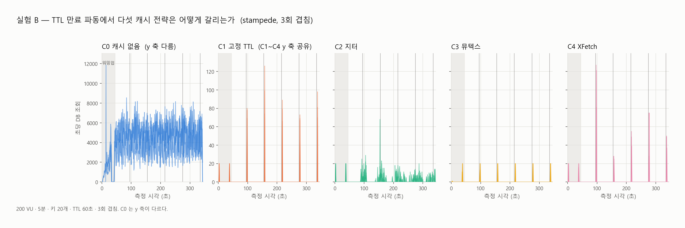
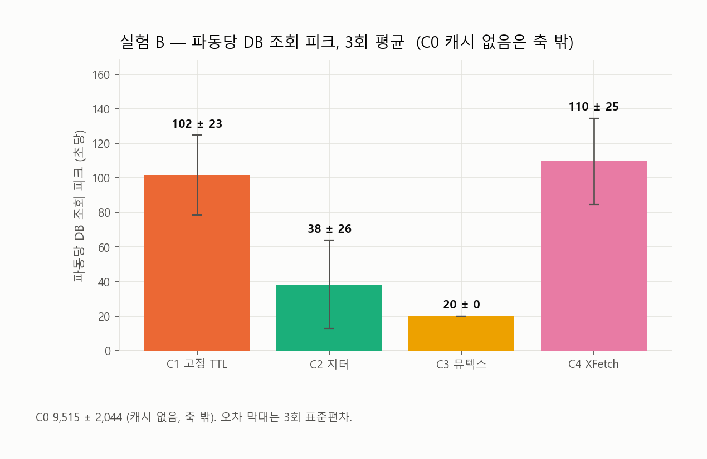

# 선착순 발급 시스템 — 쓰기/읽기 병목 비교 실험

> 선착순 쿠폰 발급 서비스를 만들되, 기능이 아니라 **비기능 요구사항(정합성 · 응답 시간 · 장애 내성)을 만족하는 설계가 무엇인지를 측정으로 증명**한다.
> 재고 차감 전략 5개(W0~W4)와 캐시 전략 5개(C0~C4)를 같은 조건에서 3회씩 쟀고, 그 숫자로 **[설계](ARCHITECTURE.md)** 를 정했다.

## 핵심 결과 3개

| | 결과 | 근거 |
|---|---|---|
| **1** | **서버를 3대로 늘리는 순간 JVM 로컬 락(W0)은 50,000건을 초과 발급한다.** 1대에서는 다섯 전략 전부 초과 0 이라 변별력이 없다. 잠금은 프로세스 밖에 있어야 한다 | [3주차 전반](results/week3-experiment-a-stage2/summary.md) |
| **2** | **DB 를 요청 경로에서 뺀 W4(Redis 원자 연산)만 P99 500ms 와 30분 열화 기준을 통과했다.** 처리량 16배. 대신 Redis 가 죽으면 발급 사실 45,868건이 사라진다 — 빠름의 청구서 | [2주차](results/week2-experiment-a/summary.md) |
| **3** | **캐시 히트율 99.98% 뒤에서 DB 는 60초마다 100건을 한 초에 맞는다.** 그것을 실제로 줄이는 것은 뮤텍스(C3)뿐이다 — 피크 20, 3회 편차 0. 지터와 XFetch 는 최악을 막지 않는다 | [3주차 후반](results/week3-experiment-b/summary.md) |

<picture>
  <source media="(prefers-color-scheme: dark)" srcset="results/week3-experiment-b/charts/stampede-timeline-dark.png">
  
</picture>

---

## 1. 문제 — 대용량이 아니라 순간 집중

총 처리량도 데이터 볼륨도 작다. 쿠폰 1만 장이면 성공 응답도 1만 건이다. 극단적인 것은 **순간 집중도** 하나다 — 1초 안에 수천 요청이 **같은 행 하나**를 두고 경합한다. 그래서 병목은 CPU 나 디스크가 아니라 **락 대기와 커넥션 풀**에서 먼저 온다.

이 저장소가 답하려는 질문은 [`PROJECT_BRIEF.md`](PROJECT_BRIEF.md) 2장의 여섯 개다. 요약하면 셋이다.

- 동시 요청이 늘 때 **쓰기 경로에서 가장 먼저 포화되는 구간**은 어디이고, 인스턴스가 **1대에서 3대가 되는 순간** 어떤 전략이 깨지는가
- 읽기 경로에 캐시를 붙이면 **TTL 이 만료되는 그 순간** 무슨 일이 벌어지고, 방어 기법 중 실제로 DB 스파이크를 줄이는 것은 무엇인가
- 쓰기 병목과 읽기 병목은 **성격이 다르고 해법도 다르다**는 것을 숫자로 보일 수 있는가

## 2. 요구사항 — 알고 자른 것과 모르고 안 만든 것은 다르다

**기능 요구사항** — 12개를 식별하고 실험에 필요한 5개만 구현했다.

| 구현 | 제외 |
|---|---|
| FR-01 발급 요청 (1인 1매) · FR-02 재고 소진 시 거부 · FR-03 상세 조회(남은 수량) · FR-04 목록 조회 · FR-05 발급 기간 검증 | 할인 계산 · 사용/취소 · 사용 조건 · 인증/회원 · 관리자 화면 · 알림 · 만료 배치 |

<details>
<summary>제외 7개의 근거</summary>

| ID | 요구사항 | 근거 |
|---|---|---|
| FR-06 | 쿠폰 종류별 할인 계산 | 재고 경합과 무관한 계산 로직 |
| FR-07 | 쿠폰 사용 및 사용 취소 | 발급 시점의 경합이 실험 대상 |
| FR-08 | 최소 주문 금액 등 사용 조건 | 도메인 규칙 복잡도만 증가 |
| FR-09 | 사용자 인증 / 회원 관리 | 부하 테스트 시 `user_id` 직접 전달로 대체 |
| FR-10 | 관리자 쿠폰 등록/수정 화면 | 초기 데이터는 시드 스크립트로 주입 |
| FR-11 | 발급 알림 (푸시/이메일) | 외부 의존성이 측정 노이즈를 만듦 |
| FR-12 | 쿠폰 만료 처리 배치 | 실험 구간과 시간 축이 다름 |

</details>

**비기능 요구사항** — 이것이 실험의 성공 기준이다.

| ID | 요구사항 | 판정 |
|---|---|---|
| NFR-01 | 초과 발급 0건 | 1건이라도 초과 시 **즉시 탈락** |
| NFR-02 | 1인 1매 보장 | 1건이라도 중복 시 **즉시 탈락** |
| NFR-03 | 동시 요청 1,000건에서 P99 ≤ 500ms | 초과 시 해당 동시성에서 미달 |
| NFR-04 | 재고 소진 후 유입 요청에도 정상 응답 | 소진 후 5xx 발생 시 미달 |
| NFR-05 | 캐시 계층 장애 시 발급 정합성 유지 | Redis 강제 종료 후 NFR-01/02 재검증 |
| NFR-06 | 30분 지속 부하에서 성능 열화 없음 | 우하향 추세 시 원인 규명 필요 |
| NFR-07 | 인스턴스 3대에서도 NFR-01/02 유지 | 초과 · 중복 발생 시 미달 |

## 3. 실험 설계

| 쓰기 — 재고 차감 | 구현 요지 | 예상 실패 모드 |
|---|---|---|
| **W0** JVM 로컬 락 | `ReentrantLock` 으로 임계 구역 보호 | 인스턴스 2대부터 정합성 붕괴 |
| **W1** 비관적 락 | `SELECT ... FOR UPDATE` 후 차감 | 락 대기 → 커넥션 풀 고갈 |
| **W2** 낙관적 락 | `@Version` + 충돌 시 재시도 | 재시도 폭주 |
| **W3** 분산 락 | Redisson `RLock` 후 DB 차감 | 락 대기 + DB 왕복 누적 |
| **W4** Redis 원자 연산 | Lua 로 차감 · 중복 체크, DB 반영은 비동기 워커 | Redis 장애 시 정합성 공백, 반영 지연 |

| 읽기 — 캐시 | 구현 요지 | 관찰 포인트 |
|---|---|---|
| **C0** 캐시 없음 | 매 요청 DB | 기준선 |
| **C1** Cache-Aside + 고정 TTL 60초 | 미스 시 DB 조회 후 저장 | **스탬피드 재현** |
| **C2** TTL 지터 ±10초 | 만료 시점 분산 | 톱니가 퍼지는가 |
| **C3** 뮤텍스 | 미스 시 하나만 DB, 나머지는 대기 (상한 2초) | 대기 요청의 비용 |
| **C4** 확률적 조기 갱신 (XFetch, β = 1) | 만료 전 확률적으로 미리 갱신 | 미스 자체가 사라지는가 |

**두 단계로 나눈다.** 1단계는 **1대**에서 성능(ramp · spike · soak · chaos), 2단계는 **3대**에서 정합성만(spike). 실험 B 는 1대 고정.
**공정성** — DB 커넥션 총량 **30** 고정(1대 풀 30 / 3대 10 × 3), 톰캣 200, 힙 1g, 검증 순서와 응답 포맷 동일. 비교군 간 차이는 동시성 제어 방식 하나다.
**신뢰성** — 매 실행 전 초기화, 같은 조건 **3회 반복**, 러너 스크립트가 순서를 강제. 로컬 Docker 한 대, k6 는 compose 네트워크 안. 조건과 한계는 각 `results/<주차>/conditions.md`.

## 4. 결과

### 4-1. 어디서 먼저 포화되는가 — ramp, 200 → 2,000 동시

<picture>
  <source media="(prefers-color-scheme: dark)" srcset="results/week2-experiment-a/charts/ramp-comparison-dark.png">
  
</picture>

| P99 (ms, 3회 평균) | 200 VU | 1,000 | 2,000 | 처리량 | 풀 `pending` |
|---|---|---|---|---|---|
| W0 로컬 락 | 2,347 | 5,310 | 7,785 | 290/s | 0 |
| W1 비관적 락 | 1,538 | 4,962 | 8,595 | 270/s | **171** |
| W2 낙관적 락 | 3,897 | 8,906 | 15,031 | 165/s | **171** |
| W3 분산 락 | 2,495 | 6,222 | 10,793 | 204/s | 0 |
| **W4** Redis 원자 | **143** | **492** | 880 | **4,699/s** | 0 |

가장 먼저 포화되는 것은 **커넥션 풀**이고, 그것을 태우는 것은 **락이 DB 안에 있는 두 전략(W1 · W2)** 뿐이다. W1 의 진짜 비용은 "느리다" 가 아니라 락을 기다리는 동안 커넥션을 쥔다는 것이고, 그 결과가 풀 30 가득 · 대기 171 · 3초 타임아웃 예외다. 커넥션은 다른 API 와 나눠 쓰는 자원이라 **쿠폰 발급이 서비스 전체를 마비시킬 수 있다.** W3 는 락을 잡은 뒤에야 트랜잭션을 열어 W0 와 같은 모양(active 1)이다 — 대기가 DB 밖에서 일어난다. W4 만 1,000 동시에서 500ms 안에 들어왔다. → [2주차 3장](results/week2-experiment-a/summary.md)

### 4-2. 3대에서 무엇이 깨지는가 — 1대 vs 3대

| 전략 | 1대 초과 발급 | **3대 초과 발급** | 3대에서 쿠폰 받음 / 5xx | NFR-07 |
|---|---|---|---|---|
| **W0** | 0 | **50,000 / 50,000 / 50,000** | 150,000 (재고 초과) / 0 | **탈락** |
| W1 | 0 | 0 | 100,000 / **28,592** | 유지 |
| W2 | 0 | 0 | **29,336** / 75,527 | 유지 |
| W3 | 0 | 0 | **87,241** (완판 실패) / 62,768 | 유지 |
| **W4** | 0 | 0 | **100,000 / 0**, 1.9분 | 유지 |

W0 가 깨지는 기전은 갱신 손실이다. Hibernate 더티 체킹이 `issued_count = 100` 처럼 **절대값**을 쓰므로, 세 JVM 이 각자 자기 락을 통과해 같은 값을 읽고 같은 값을 덮어쓴다. 재고 100,000 에 150,000 이 발급되고 `SOLD_OUT` 응답은 0건이다.

그런데 표의 오른쪽 열이 더 중요하다. **정합성을 지킨 것과 제 역할을 한 것은 다르다.** 커넥션 총량 30 을 3으로 나누자 풀 10 뒤에 톰캣 스레드 200 이 줄을 섰고, 커넥션을 쥔 채 기다리는 전략일수록 무너졌다. W3 는 62,768명에게 503 을 돌려주고 완판에 실패했다. 3대에서도 멀쩡한 것은 요청 경로에 DB 가 없는 W4 뿐이다. → [3주차 전반](results/week3-experiment-a-stage2/summary.md)

### 4-3. 30분 지속과 Redis 장애 — soak · chaos

<picture>
  <source media="(prefers-color-scheme: dark)" srcset="results/week2-experiment-a/charts/soak-timeline-dark.png">
  
</picture>

| 30분 후 처리량 변화 | W0 | W1 | W2 | W3 | **W4** |
|---|---|---|---|---|---|
| 평균 | −26.5% | −24.9% | **−79.6%** | −24.4%¹ | **−2.7%** |
| 발급 1건당 DB 커밋 | 1.0 | 1.0 | **13 ~ 18** | 1.0 | **0.002** |

계단 하락은 락 전략의 성질이 아니었다. 체크포인트도 autovacuum 도 시점이 안 맞았고, 실제로 떨어진 것은 **커밋 처리 능력**(초당 290 → 190)이다. 하락 폭이 정확히 **발급 1건당 커밋 수 순서**라는 것이 증거다 — 재시도마다 커밋하는 W2 가 가장 크게, 500건을 한 트랜잭션으로 쓰는 W4 가 가장 작게. → [3주차 soak 후속](results/week3-soak-followup/summary.md)

<picture>
  <source media="(prefers-color-scheme: dark)" srcset="results/week2-experiment-a/charts/chaos-loss-dark.png">
  
</picture>

발급 50,000건 시점에 Redis 를 죽이고 10초 뒤 빈 상태로 재시작했다. **W3 는 시간을 잃고 W4 는 사실을 잃는다.** W3 는 10초 동안 실패하고 정상 재개한다(k6 발급 − DB 행 = −1). W4 는 평균 **45,868명**이 "받았다" 는 응답을 받았지만 그 기록은 큐와 함께 사라졌다 — 그런데 DB 만 보면 **초과 0 · 중복 0 으로 완벽하다.** `k6 발급 − DB 행` 을 함께 기록하지 않았다면 이 손실은 보이지 않았다. 30분 부하의 반영이 39분 걸린 것이 그 구간의 크기다. → [2주차 5 · 6장](results/week2-experiment-a/summary.md)

### 4-4. TTL 만료 순간 — stampede, 20키 · 200 VU · 5분

<picture>
  <source media="(prefers-color-scheme: dark)" srcset="results/week3-experiment-b/charts/stampede-peak-dark.png">
  
</picture>

| | 파동당 피크 DB 조회 (3회) | 5분간 DB 조회 총량 | 대기 | P99 |
|---|---|---|---|---|
| C0 캐시 없음 | 9,515 ± 2,044 (평평) | 1,372,228 | — | 205ms |
| C1 고정 TTL | 102 ± 23 | 446 | — | 87.5ms |
| C2 지터 | 38 ± 26 | 563 (+26%) | — | — |
| **C3 뮤텍스** | **20 ± 0** | **121 ± 0** | 734건 · 평균 60ms | 90.8ms |
| C4 XFetch | 110 ± 25 | 390 | — | — |

C1 의 파동 15개가 전부 60초 간격이고 파동 사이는 0 이다. 5분치 DB 조회의 90% 가 5초에 몰린다. **히트율 99.98% 와 "DB 가 순간적으로 100건을 맞는다" 는 같은 실행의 두 얼굴이다.** 셋 다 모양은 달라졌지만 "줄였는가" 로 물으면 답이 갈린다. 지터는 피크를 1/3 로 낮추는 대신 편차가 크고 총 미스가 늘었다. XFetch 는 β = 1 이 여유 0 의 설정이라 첫 만료를 못 막았다. 뮤텍스만 3회가 자릿수까지 같고, 그 대가인 734건의 60ms 대기는 전체의 0.03% 라 P99 에 잡히지 않는다 — 미스 전용 타이머를 따로 두지 않았으면 어디에도 기록되지 않았을 비용이다. → [3주차 후반](results/week3-experiment-b/summary.md)

## 5. NFR 충족 매트릭스와 트레이드오프

| | NFR-01/02 정합성 (1대) | NFR-03 P99 ≤ 500ms | NFR-04 소진 후 5xx | NFR-05 Redis 장애 | NFR-06 30분 열화 | NFR-07 3대 정합성 |
|---|---|---|---|---|---|---|
| W0 | 만족 | 미달 (200부터) | 만족 | 해당 없음 | 미달 −26.5% | **탈락** |
| W1 | 만족 | 미달 (200부터) | 만족 | 해당 없음 | 미달 −24.9% | 유지 |
| W2 | 만족 | 미달 (200부터) | 판정 불가 (매진 실패) | 해당 없음 | 미달 −79.6% | 유지 |
| W3 | 만족 | 미달 (200부터) | **미달** (소진 후 락 타임아웃 503) | 유지 (−1) | 미달 −24.4%¹ | 유지 |
| **W4** | 만족 | **만족** (1,000 · 492ms) | 만족 | 정합성 유지, **발급 사실 유실** | **만족** −2.7% | 유지 |

¹ 2주차 1회 스크리닝에서 W3 는 "하락 없음" 이었으나 3주차 후속 2회(−23.7% · −25.0%)에서 뒤집혔다. 1회 측정의 착시였다.

| 전략 | 얻는 것 | 잃는 것 | 언제 |
|---|---|---|---|
| W0 | 가장 단순한 기준선 | 인스턴스 2대부터 초과 발급 | 인스턴스가 1대로 확정된 경우뿐 |
| W1 | 정합성이 확실하고 구현이 단순 | 락 대기 중 커넥션 점유 → 풀 고갈이 다른 API 로 번진다 | "응답 = DB 커밋" 이 요구사항이고 커넥션 예산이 넉넉할 때 |
| W2 | 락이 없다 | 충돌이 기본인 워크로드에서 재시도 폭주, 재고 절반을 못 판다 | 충돌이 드문 곳. 선착순에는 맞지 않는다 |
| W3 | 인스턴스를 늘릴 권리 | W0 보다 23% 느리고, 3대에서 락 타임아웃 503 | 정합성만 필요하고 처리량은 낮아도 될 때 |
| **W4** | 16배 처리량, NFR-03 · 06 · 07 유일 통과 | 사실이 메모리에만 있는 구간 — 유실 45,868 · 반영 39분 | **그 구간을 갚는 설계와 함께** ([설계](ARCHITECTURE.md) 3장) |

## 6. 결론 — 그래서 어떻게 만들어야 하는가

**쓰기 병목과 읽기 병목은 성격이 다르다.** 쓰기 병목은 **직렬화를 어디에 두는가**의 문제다. JVM 안에 두면 3대에서 깨지고(50,000), DB 행에 두면 커넥션이 마르고(대기 171), Redis 에 두면 빠르지만 사실이 메모리에만 있는 구간이 생긴다(45,868). 읽기 병목은 **같은 일을 몇 번 하는가**의 문제다. 만료 순간 100건이 같은 행을 읽고, 그것을 1건으로 합치는 것(20)만이 답이었다. 둘 다 "DB 를 보호한다" 지만 해법은 다르다 — **쓰기는 DB 를 요청 경로에서 빼고, 읽기는 재계산을 하나로 합친다.**

그 위에서 설계를 정했다. 선택마다 측정값인지 문서 근거인지 표기해 두었고, 측정하지 않은 것은 따로 모아 적었다. → **[`ARCHITECTURE.md`](ARCHITECTURE.md)**

- **재고 차감은 Redis 원자 연산.** 응답은 Kafka 에 동기 발행(acks=all)한 뒤 준다 — "발급 = 확정" 의 의미를 유지하면서 사실이 응답 전에 디스크에 남는다. Redis 차감과 발행의 이중 쓰기는 멱등 재발행과 대사 잡으로 갚는다
- **소비자는 파티션 = 쿠폰, 배치 INSERT, 배치당 카운터 1회.** 행마다 올리면 실험이 본 뜨거운 행 경합이 소비자 안에서 재현된다
- **잔량은 캐시가 아니라 Redis 카운터에서 읽는다.** 쓰기가 Redis 에 있으면 진실값이 이미 거기 있다 — 실험 A 와 B 를 합쳐야 나오는 결론. 바뀌지 않는 메타만 Cache-Aside + 뮤텍스
- **Redis 가 죽으면 발급을 멈춘다** (fail-closed + replica). 명단 없이 재개하는 것이 chaos 의 45,868 을 만들었다

## 7. 틀렸던 예상과 한계

- **호스트에서 돌린 k6 41회를 폐기했다.** Docker Desktop 의 포트 프록시가 1,000 VU 연결을 일부 거부하고 처리량을 30% 깎았다. 정식 측정은 compose 네트워크 안에서 다시 했다 ([D-09](PROJECT_BRIEF.md))
- **W3 의 soak "예외" 는 1회 측정의 착시였다.** 3회에서 다른 락 전략과 같은 폭으로 떨어졌다
- **C4 의 "양의 되먹임" 은 과잉 해석이었다.** 1회 관측에서 파동이 커지는 패턴을 보고 기전을 썼는데 3회에서 재현되지 않았다. 정정했다 ([실험 B 4장](results/week3-experiment-b/summary.md))
- **C1 의 피크는 예상(200)의 절반(102)이었다.** 키당 겹침이 4개에 그쳤다. 닫힌 루프 부하라 요청이 서로 줄을 선다
- **한계** — 로컬 Docker 한 대에 k6 동거. 커밋 천장(초당 290 → 190)은 이 환경의 스토리지 특성이라 **상대 비교만 유효하고 절대값은 아니다.** 실험 B 는 1대 고정이라 다중 인스턴스의 뮤텍스는 재지 않았다. Redis 명령 수 · 메모리는 기록하지 않았다. 각 주차 summary 의 "예상 대 실측" 표에 전부 있다

## 8. 재현

```powershell
docker compose up -d --build                                                             # 1대 스택
docker compose -f docker-compose.yml -f docker-compose.scale.yml up -d --scale app=2     # 3대 스택 (app ×2 + app-worker + nginx)
.\run-experiment.ps1 -Strategy W0 -Scenario spike -Run 1                                 # 실험 A 1회 — 초기화 → 부하 → 판정 → 저장
.\run-cache.ps1 -Cache C1 -Run 1                                                         # 실험 B 1회
python tools/make-charts.py                                                              # 그래프 재생성 — 커밋된 원본만으로 그린다
```

Windows PowerShell 기준이며 compose 명령 자체는 OS 와 무관하다. 시드 · 전략 교체 · 정합성 판정 · 테스트 · 러너 옵션은 [`results/README.md`](results/README.md). 측정 원본(k6 JSON · 1초 시계열 · 정합성 판정)은 전부 커밋돼 있어 **재측정 없이** 표와 그래프를 다시 만들 수 있다.

## 9. 구조와 작업 방식

| 경로 | 내용 |
|---|---|
| [`ARCHITECTURE.md`](ARCHITECTURE.md) | 측정 결과로 정한 설계 — 측정값 / 문서 근거 / 결정 표기 |
| [`PROJECT_BRIEF.md`](PROJECT_BRIEF.md) | 단일 기준(SSOT) — 요구사항, 실험 설계, 확정된 결정 D-01~D-14 |
| [`results/`](results/README.md) | 주차별 측정 원본과 `summary.md` (3회 평균 · 편차 · 해석 · 예상 대 실측) |
| [`docs/`](docs/README.md) | CS 개념 정리 10편 — 각 문서 7장에 이 프로젝트의 측정값 |
| `app/` | Spring Boot 3 · Java 21. `strategy/` 에 W0~W4 와 C0~C4, 각각 같은 인터페이스(`CouponIssueStrategy` · `CouponReadStrategy`)로 교체 |
| `infra/` · `docker-compose*.yml` | PostgreSQL · Redis · nginx · Prometheus · Grafana. 3대 스택은 오버레이 |
| `loadtest/` · `seed/` · `tools/` | k6 시나리오 5개 · 시드와 판정 SQL · 그래프 생성기 |
| `run-*.ps1` | 측정 1회 러너와 주차 배치 러너 (무인 · 재개 가능) |
| `plan/` | 주차별 작업 계획과 진행 기록 |

**작업 방식.** 브리프를 단일 기준으로 두고 AI 에이전트(Claude Code)와 진행했다. 에이전트는 구현 · 측정 배관 · 초안을 맡았고, **설계 결정은 선택지와 트레이드오프를 받아 사람이 내렸다** — 브리프 12장의 D-01~D-14 가 그 기록이다. 예상을 측정 전에 적고 실측과 대조하는 규칙, 1회 관측으로 결론 내지 않는 규칙, 미달을 그대로 기록하는 규칙을 지켰다. 커밋 히스토리에 공동 저자 표기가 그대로 남아 있다.
