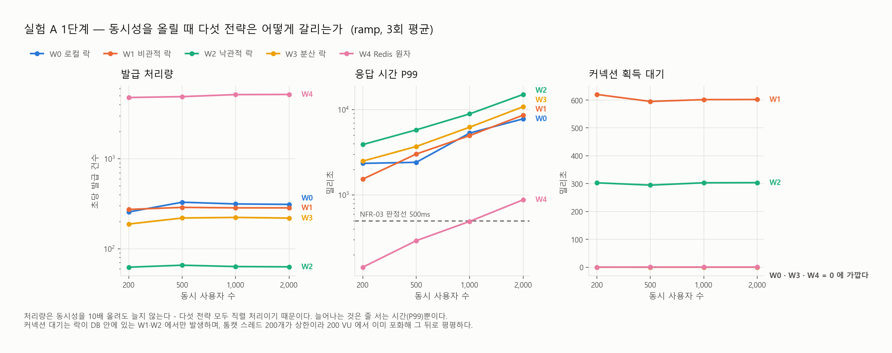
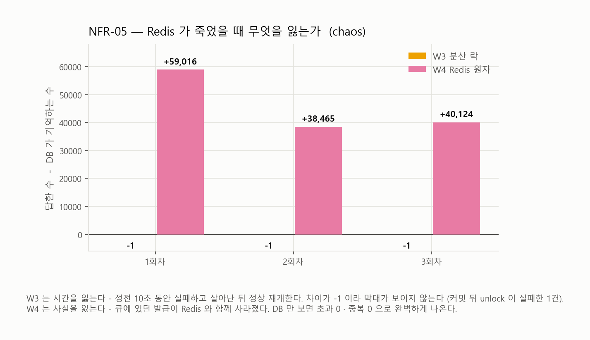
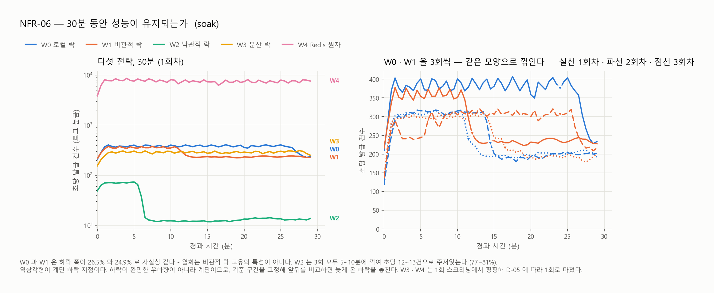

# 2주차 결과 — 실험 A 1단계 (W0~W4, 단일 인스턴스)

> **측정** 2026-09-15, 총 47회 — 정식 41회(ramp 15 / spike 15 / chaos 6 / soak 5, 커밋 `fff48c3`) +
> D-05 에 따른 soak 보강 6회(W0 · W1 · W2 의 2·3회차). 보강분은 측정 코드가 같은 뒤 커밋이다 (`conditions.md` 한계 12).
> 조건은 [`conditions.md`](conditions.md), 원본은 `raw/` · `log/` · `integrity/`.

## 한 줄 결론

**정합성은 다섯 전략 모두 지켰다. 갈린 것은 속도와 그 대가다.**
W4(Redis 원자 연산)가 처리량 16배로 압도했지만, Redis 가 죽는 순간 **평균 45,868건의 발급이 사라졌다** — 사용자는 받았다고 알고 있고 서버는 모르는 상태다. W2(낙관적 락)는 이 워크로드에서 **재고를 다 팔지도 못했다.**

---

## 1. 이 폴더를 읽는 법

| 파일 | 무엇 | 언제 보나 |
|---|---|---|
| `runs.tsv` | 47회 실행의 한 줄 요약 (시각·전략·시나리오·회차·소요·임계값·반영지연·k6 발급·DB 행·5xx·커밋) | **여기서 시작한다.** 이상한 행을 찾아 아래로 내려간다 |
| `raw/<전략>-<시나리오>-run<N>.json` | k6 요약 원본. P99·처리량·카운터의 **출처** | 숫자를 다시 계산하거나 확인할 때 |
| `log/<...>.txt` | k6 터미널 출력 (사람이 읽는 형태) | 실행이 어떻게 흘렀는지 볼 때 |
| `log/<...>.app.txt` | 앱의 예외 클래스별 건수 | **5xx 가 왜 났는지** 알고 싶을 때 |
| `log/<...>.chaos.txt` | Redis 를 죽이고 살린 시각 (chaos 만) | 정전 구간을 그래프와 맞출 때 |
| `integrity/<...>.txt` | `verify.sql` 출력 — 초과 발급·중복·카운터 불일치 | **NFR-01/02 판정.** 이 값이 0 이 아니면 그 전략은 탈락 |
| `log/batch-*.txt` | 배치 러너 전체 기록 | 실행 순서와 중단 이력 |
| `charts/` | 비교 그래프(라이트·다크)와 그 원천 수치 `data.json` | 다시 그리려면 `python tools/make-charts.py` |

### `runs.tsv` 의 두 열이 핵심이다

- **`k6_issued` − `db_rows`** — 앞은 사용자에게 *"받았습니다"* 라고 **답한 횟수**, 뒤는 서버가 **기억하는 발급 수**. 평소엔 같다. **양수면 서버가 잊어버린 발급**(사용자는 받은 줄 안다), **음수면 사용자가 모르는 발급**(DB 엔 있는데 응답을 못 받았다).
- **`reflect_wait_s`** — W4 전용. 부하가 끝난 뒤 DB 가 따라잡는 데 걸린 시간.

### 주의 — 숫자를 잘못 읽기 쉬운 두 곳

1. **`k6_issued` 에는 워밍업 발급이 섞여 있다.** spike 에서 W4 의 `k6_issued` 가 166,135 인 것은 초과 발급이 아니라 워밍업(다른 쿠폰)이 빠른 만큼 많이 돈 것이다. 실제 `spike-coupon` 발급은 `integrity/` 가 말해준다 — 매진한 네 전략 모두 정확히 **100,000**.
2. **ramp · soak 의 `k6_issued − db_rows` 음수는 정상이다.** 부하 종료 시점에 k6 가 줄 서 있던 요청을 끊는데 서버는 그것을 끝까지 처리해 커밋한다 (`conditions.md` 한계 7).

---

## 2. NFR 판정

| NFR | 판정 | 근거 |
|---|---|---|
| **NFR-01** 초과 발급 0건 | **전 전략 만족** | 47/47 실행에서 `over_issue` = 0 |
| **NFR-02** 1인 1매 | **전 전략 만족** | 47/47 에서 `duplicate_users` = 0 |
| **NFR-03** 1,000 VU P99 ≤ 500ms | **W4 만 만족** (492ms) | W4 는 1,000 까지 만족, **2,000 부터 미달**(880ms). W0·W1·W2·W3 는 **200 부터 미달** |
| **NFR-04** 소진 후 5xx 0건 | W0 · W1 · W4 만족 / **W3 미달** / **W2 판정 불가** | 아래 표 |
| **NFR-05** Redis 장애 시 정합성 | **W3 유지 / W4 정합성은 유지, 발급 사실은 유실** | DB 는 둘 다 100,000 행 정확. W4 는 `k6−DB` 평균 **+45,868** |
| **NFR-06** 30분 열화 없음 | **W0 · W1 · W2 미달** / W3 · W4 만족 | W0 −26.5% · W1 −24.9% · W2 −79.6% (각 3회). W0 과 W1 이 사실상 같다는 것이 이번 주차의 가장 뜻밖의 결과다 — 열화는 락 전략의 특성이 아니다 (6장). W3 · W4 는 1회 스크리닝에서 평평 (D-05) |
| **NFR-07** 3 인스턴스 | 3주차 | — |

### NFR-04 를 나눠 본 이유

"소진 **후**" 가 판정 구간이므로 5xx 가 소진 전인지 후인지를 시계열로 갈랐다.

| | spike 5xx (3회) | 소진 후 5xx | 판정 |
|---|---|---|---|
| W0 | 0 / 0 / 0 | 0 | **만족** |
| W1 | 23 / 5 / 9 | **0** — 전부 소진 **전**(발급 경합 중 커넥션 풀 대기 초과) | **만족** |
| W2 | 1,107 / 457 / 415 | — | **판정 불가** (매진 자체를 못 했다) |
| W3 | 1,262 / 149 / 0 | **19 / 2 / 0** | **미달** (1건이라도 나오면 미달) |
| W4 | 0 / 0 / 0 | 0 | **만족** |

W3 의 소진 후 5xx 는 `LOCK_TIMEOUT`(503) 이다. 소진된 뒤에도 락을 잡으러 가기 때문에, 대기 3초를 넘긴 요청이 "품절" 대신 503 을 받는다. 설계 때 [`docs/distributed-lock.md`](../../docs/distributed-lock.md) 7장에 *"나오면 W3 는 NFR-04 미달로 기록한다"* 고 적어둔 그대로다.

---

## 3. ramp — 어디서 꺾이는가 (3회)

<picture>
  <source media="(prefers-color-scheme: dark)" srcset="charts/ramp-comparison-dark.png">
  
</picture>

**계단별 P99 (ms, 3회 평균)**

| | 200 VU | 500 | 1,000 | 2,000 |
|---|---|---|---|---|
| W0 로컬 락 | 2,347 | 2,415 | 5,310 | 7,785 |
| W1 비관적 락 | 1,538 | 3,019 | 4,962 | 8,595 |
| W2 낙관적 락 | 3,897 | 5,789 | 8,906 | **15,031** |
| W3 분산 락 | 2,495 | 3,699 | 6,222 | 10,793 |
| **W4 Redis 원자** | **143** | **292** | **492** | **880** |

> W0 의 200 VU 평균이 W1 보다 높은 것은 1회차 4,519ms 때문이다 (2·3회차는 1,293 · 1,229ms). 배치 첫 실행의 콜드 효과이며, 다른 계단과 시나리오에서는 나타나지 않는다.

**처리량 (iter/s, 3회 평균 ± 표준편차)**

| W0 | W1 | W2 | W3 | W4 |
|---|---|---|---|---|
| 290 ± 10 | 270 ± 27 | 165 ± 13 | 204 ± 19 | **4,699 ± 510** |

**커넥션 풀 — 이번 주차에서 가장 선명한 그림**

| | `hikaricp_connections_active` | `pending` |
|---|---|---|
| W0 | 1.0 | **0** |
| **W1** | **30.0 (풀 가득)** | **171** |
| **W2** | **30.0 (풀 가득)** | **171** |
| W3 | 1.0 | **0** |
| W4 | 1.0 (평균 0.4) | **0** |

락이 DB 안에 있는 두 전략(W1·W2)만 풀을 태운다. W1 의 진짜 비용은 "느리다" 가 아니라 **락을 기다리는 동안 커넥션을 쥔다**는 것이고, 그 결과가 `pending` 171 과 `CannotCreateTransactionException`(3초 풀 대기 초과)이다. W3 는 락을 **잡은 뒤에야** 트랜잭션을 열기 때문에 W0 와 같은 모양(active 1.0)이 나온다 — 대기가 DB 밖에서 일어난다.

---

## 4. spike — 선착순 순간 (3회)

| | spike-coupon 발급 | P99 (ms) | 처리량 (iter/s) | 5xx |
|---|---|---|---|---|
| W0 | **100,000** 매진 | 6,306 | 337 | 0 |
| W1 | **100,000** 매진 | 5,422 | 309 | 12 |
| W2 | **58,582** — 매진 실패 | 8,772 | 167 | 660 |
| W3 | **100,000** 매진 | 7,981 | 269 | 470 |
| W4 | **100,000** 매진 | **678** | **2,816** | 0 |

### W2 는 재고를 다 팔지 못했다

150,000 요청으로 재고 100,000 을 못 채웠다 (56,974 / 59,278 / 59,495). 원인은 재시도 폭주다.

| | 발급 | CONFLICT | 재시도 | **발급 1건당 재시도** |
|---|---|---|---|---|
| ramp | 37,860 | 62,452 | 234,534 | **6.2회** |
| spike | 59,340 | 92,468 | 352,824 | **5.9회** |
| **soak** | 44,696 | 149,150 | 493,694 | **11.0회** |

모두가 같은 행 하나를 노리므로 낙관적 락의 전제("웬만하면 충돌 안 난다")가 정반대다. 4회 시도를 다 쓰고 409 로 끝난 요청이 발급보다 많다. 2단계에서 열어뒀던 "미달 발급" 쟁점이 여기서 실제로 나타났다 — 테스트(요청 = 재고의 10배)에서는 안 보이고 실제 경합비(1.5:1)에서 드러났다.

---

## 5. chaos — Redis 를 죽였을 때 (3회, W3 · W4)

<picture>
  <source media="(prefers-color-scheme: dark)" srcset="charts/chaos-loss-dark.png">
  
</picture>

발급 50,000 건 시점에 `docker kill redis`, 10초 뒤 빈 상태로 재시작 (D-07).

| | k6 발급 − DB 행 | 5xx | 5xx 의 정체 |
|---|---|---|---|
| **W3** | **−1 / −1 / −1** | 453 / 824 / 1,805 | `LOCK_TIMEOUT` 252·624·1,596 + Redis 예외 201·200·209 |
| **W4** | **+59,016 / +38,465 / +40,124** | 265 / 313 / 251 | 전부 `WriteRedisConnectionException` |

**두 전략이 잃는 것의 종류가 다르다.**

- **W3 는 시간을 잃는다.** 정전 10초 동안 요청이 실패하고, 살아난 뒤 정상 재개한다. −1 은 kill 순간 락을 쥐고 있던 요청 하나 — 트랜잭션은 커밋됐는데 `unlock()` 이 실패해 클라이언트만 500 을 받았다. 세 번 모두 정확히 −1 이다.
- **W4 는 사실을 잃는다.** 평균 45,868명이 201 을 받았지만 그 기록은 큐와 함께 사라졌다. 재시작 후 DB 를 기준으로 재적재해 그 자리를 다른 사람들이 채웠다. **`verify.sql` 은 초과 0 · 중복 0 으로 완벽하게 나온다** — DB 만 보면 아무 문제가 없다. `k6_issued − db_rows` 를 함께 기록하지 않았다면 이 손실은 보이지 않았다.

---

## 6. soak — 30분 지속 부하

1회 스크리닝에서 하락이 보인 **W0 · W1 · W2 를 3회씩** 채웠다 (확정값 D-05).

<picture>
  <source media="(prefers-color-scheme: dark)" srcset="charts/soak-timeline-dark.png">
  
</picture>

| | 회수 | 발급 (평균 ± 편차) | P99 (ms) | 5xx | **계단 하락** |
|---|---|---|---|---|---|
| **W0** | **3** | 513,171 ± 131,274 | 1,413 | 0 | **−26.5% ± 10.5** |
| **W1** | **3** | 490,159 ± 37,108 | 1,551 | 3 | **−24.9% ± 12.4** |
| **W2** | **3** | 44,424 ± 10,685 | 5,422 | **17,954** | **−79.6% ± 2.2** |
| W3 | 1 | 515,996 | 1,130 | 0 | 없음 (오히려 +2.4%) |
| W4 | 1 | **13,712,033** | **89** | 0 | −2.7% |

**W4 는 30분 내내 P99 89ms 로 평평하다** — 다섯 중 유일하게 NFR-03 판정선(500ms)을 통과한 실행이다.

### 열화는 서서히가 아니라 "계단"으로 일어난다

분당 처리량을 그려 보면 완만한 우하향이 아니라 **어느 순간 한 단계 떨어져 그 높이로 유지**된다.
그래서 "앞 구간 대 뒤 구간" 으로는 **하락 여부가 아니라 하락 시점**을 재게 된다. 하락 지점은
앞뒤를 각각 5분 이상으로 나눴을 때 낙차가 가장 큰 곳으로 찾았다.

| 실행 | 하락률 | 시점 | 앞 → 뒤 (초당 발급) |
|---|---|---|---|
| W0 1회차 | −14.5% | 24.0분 | 378 → 323 |
| W0 2회차 | −33.7% | 14.5분 | 296 → 196 |
| W0 3회차 | −31.5% | 11.5분 | 294 → 201 |
| W1 1회차 | −32.4% | 12.0분 | 346 → 234 |
| W1 2회차 | −10.6% | 24.0분 | 289 → 259 |
| W1 3회차 | −31.7% | 16.5분 | 286 → 195 |
| **W2 1회차** | **−80.6%** | 6.5분 | 66 → 13 |
| **W2 2회차** | **−81.1%** | 10.5분 | 64 → 12 |
| **W2 3회차** | **−77.1%** | 5.0분 | 51 → 12 |
| W3 1회차 | 없음 | — | 오히려 +2.4% |
| W4 1회차 | −2.7% | 11.0분 | 7,640 → 7,434 |

> **이 표는 한 번 고쳐 쓴 것이다.** 처음에는 "측정 구간 앞 1/3 대 뒤 1/3" 로 판정해 W1 2회차를
> "+5.8%, 하락 없음" 으로 기록했다. 그래프를 그리고 나서야 그 실행에도 24분째에 하락이 있었고,
> 뒤 1/3 이 그것을 거의 잡지 못했을 뿐이라는 것이 보였다. **지표가 현상의 모양과 맞지 않으면
> 숫자는 조용히 틀린 답을 준다.** 그래프를 그리는 일이 검산이었던 셈이다.

### W0 과 W1 이 같다 — 열화는 락 전략의 특성이 아니다

이번 주차에서 가장 뜻밖의 결과다.

| | 하락률 (3회) | 평균 |
|---|---|---|
| W0 로컬 락 | −14.5 / −33.7 / −31.5% | **−26.5% ± 10.5** |
| W1 비관적 락 | −32.4 / −10.6 / −31.7% | **−24.9% ± 12.4** |

편차 안에서 **구분되지 않는다.** 시점도 11~24분으로 겹친다. 처음에는 W1 의 열화를 "락 대기 중
커넥션을 점유하는 비용이 시간이 갈수록 쌓인 것" 으로 읽으려 했는데, **커넥션 풀을 전혀 압박하지
않는 W0 이 같은 폭으로 떨어진다.** 그 설명은 성립하지 않는다.

하락 시점에 커넥션 **홀딩 시간**이 함께 뛴다 (W1 1회차 80ms → 127ms, 3회차 99ms → 160ms).
트랜잭션 하나가 DB 를 붙잡는 시간이 늘어난 것이므로, 원인은 애플리케이션이 아니라 **DB 쪽**에 있다.
GC 는 0 이었고, 하락 시점의 DB 크기도 43 · 48 · 82MB 로 제각각이라 누적량이 임계치를 넘는
종류도 아니다. 체크포인트·autovacuum 같은 것을 함께 계측해야 갈리는데, 그것은 2주차 범위 밖이다.

**W3 는 W0 과 거의 같은 DB 작업을 하면서 하락이 없었다**(락만 Redis 에 있다). 이것이 단서일 수
있지만 **W3 는 1회뿐이다** — D-05 의 스크리닝에서 평평했으므로 규칙대로 1회로 마쳤다.
W0 의 1회차가 −14.5% 로 가장 약했다는 것을 생각하면, W3 도 3회를 채웠을 때 무엇이 나올지는
알 수 없다. **3주차에 DB 계측과 함께 다시 본다.**

> **후속 (3주차)** W3 는 예외가 아니었다 — 2·3회차에서 −23.7% · −25.0%. 그리고 체크포인트·autovacuum 은 둘 다 원인이 아니었다.
> 하락하는 것은 **DB 의 커밋 처리 능력**이고, 전략별 하락 폭은 **발급 1건당 커밋 수**에 비례한다.
> → [`week3-soak-followup/summary.md`](../week3-soak-followup/summary.md)

### W2 — 미달 확정, 그리고 다른 종류의 미달

3/3 재현되고 낙차가 **−79.6% ± 2.2** 로 거의 일정하다. 5~10.5분 만에 꺾이고 **세 번 모두 초당
12~13건**으로 주저앉는다. 시작값이 66 · 64 · 51 로 달라도 도착점이 같다.

W0 · W1 의 열화가 "환경이 만든 한 계단" 이라면, W2 의 것은 **전략이 만든 붕괴**다. 재시도 경합이
시간이 갈수록 누적되어 발급보다 5xx 가 많아지는 상태(평균 발급 44,424 / 5xx 17,954)로 수렴한다.
같은 "NFR-06 미달" 이라도 성질이 다르므로 리포트에서 구분해 써야 한다.

### W4 의 반영 지연 — 빠름의 청구서

| 시나리오 | 부하 시간 | **DB 가 따라잡는 데 걸린 시간** |
|---|---|---|
| spike (15만 요청) | 1분 안팎 | 12 ~ 15초 |
| ramp (8분) | 8분 | 442 ~ 547초 |
| **soak (30분)** | 30분 | **2,345초 = 39분** |

30분 부하에 39분 반영이다. 부하가 끝난 시점에 큐에 **890만 건**이 남아 있었고, 워커(100ms / 최대 500건 = 상한 5,000건/초)가 실제로는 초당 3,850건을 옮겼다. **W4 의 병목은 발급이 아니라 반영이다.** 이 구간이 길수록 chaos 에서 잃을 것도 많아진다 — 5장의 45,868건이 그 구간의 크기다.

---

## 7. 설계 때 적어둔 예상 대 실측

| 문서에 적은 예상 | 결과 |
|---|---|
| W1: `pending` 이 0 에서 처음 떠오른다, `active` 30 | **맞음** — active 30.0, pending 171 |
| W1 처리량은 W0 와 비슷하거나 소폭 낮음 | **맞음** — 270 vs 290 |
| W2: 동시성이 높을수록 재시도 폭주, 실패율 급증 | **맞음** — 발급 1건당 6~11회, 매진 실패 |
| W3: W0 와 같은 모양(active 1.0)에 처리량만 낮다 | **맞음** — active 1.0, 204 vs 290 |
| W3: `LOCK_TIMEOUT` 은 0건이어야 한다 | **틀림** — spike 최대 1,262건, 그중 소진 후 19건으로 NFR-04 미달 |
| W4: 처리량은 W0 의 수 배, P99 가장 좋음 | **맞음** — 16배, P99 89~678ms |
| W4: chaos 에서 `k6 발급 > DB 행` | **맞음** — 평균 +45,868 |
| W4: 워커가 발급 속도를 못 따라간다 | **맞음** — 30분 부하에 39분 반영 |

틀린 것은 W3 의 `LOCK_TIMEOUT` 하나다. "정상 줄서기는 1초대라 3초에 안 걸린다" 고 계산했는데, 실제로는 2,000 VU 구간과 spike 순간에 줄이 3초를 넘었다. 대기 한계 3초는 **고장일 때만 걸리는 안전선**이 아니라 **정상 과부하에서도 걸리는 선**이었다.

---

## 8. 결론

**단일 인스턴스에서 정합성은 변별력이 없다.** 다섯 전략 모두 초과·중복 0 건이다. 그래서 선택은 속도와 실패 모드로 갈린다.

| | 처리량 (soak) | NFR-03 | 장애 시 잃는 것 | 한 줄 |
|---|---|---|---|---|
| **W4** | **7,473/s** | **유일하게 통과** | **발급 사실 45,868건** | 가장 빠르고 가장 위험하다 |
| W0 | 285/s | 미달 | — (인스턴스 1대 한정) | 기준선. 2대부터 깨진다 |
| W3 | 281/s | 미달 | 가용성 10초 | W0 보다 23% 느리다. **정당화는 3주차에** |
| W1 | 272/s | 미달 | — | 커넥션 풀을 태운다. 30분 열화는 W0 과 같아 락 탓이 아니다 |
| W2 | 117/s | 미달 | — | **이 워크로드에서 탈락** — 재고를 다 팔지 못하고, 30분 뒤 초당 12건으로 주저앉는다 |

세 가지가 분명해졌다.

1. **W2 는 이 문제에 맞지 않는다.** 낙관적 락은 충돌이 드물 때 쓰는 도구인데 선착순 쿠폰은 충돌이 기본값이다. "정합성은 지켰다" 는 말이 무의미한 경우 — 팔지를 못했다.
2. **W1 의 비용은 속도가 아니라 커넥션이다.** 처리량은 W0 와 비슷한데 풀 30 이 가득 차고 171개가 줄을 선다. 커넥션은 다른 API 와 나눠 쓰는 자원이므로, 이 전략은 **쿠폰 발급이 서비스 전체를 마비시킬 수 있다.**
3. **W4 의 속도는 공짜가 아니다.** 16배 빠른 대신 사실이 메모리에만 있는 구간이 생기고, 그 구간은 부하가 길수록 커진다(39분). 그래서 "W4 를 쓰자" 는 결론은 **얼마나 잃어도 되는가** 를 정한 뒤에만 가능하다.

**W3 는 이 표에서 가장 억울한 전략이다.** W0 보다 느리고 NFR-04 도 놓쳤는데, 단일 인스턴스에서는 얻는 게 없다. 3주차에 인스턴스를 3대로 늘려 **W0 가 깨지는 순간**이 이 오버헤드의 유일한 정당화다. 그 대비가 이 실험의 설계 의도였다 (브리프 5.2).

---

## 9. 남은 일

| | |
|---|---|
| 비교 그래프 | 완료 — `charts/` (2주차 완료 기준) |
| 문서 7장 갱신 | 완료 — CS 문서 5개의 예상을 실측으로 (빗나간 둘도 그대로 남겼다) |
| 3주차 | NFR-07 — 인스턴스 3대. **W0 가 깨지는지**, W3 가 버티는지 |
| 3주차에 함께 | **계단 하락의 원인** — 하락 시점에 커넥션 홀딩 시간이 뛴다. 체크포인트·autovacuum 같은 DB 쪽 계측을 붙여야 갈린다. **W3 soak 3회**도 함께 (지금은 1회뿐이라 "W3 만 예외" 를 단정할 수 없다) |
